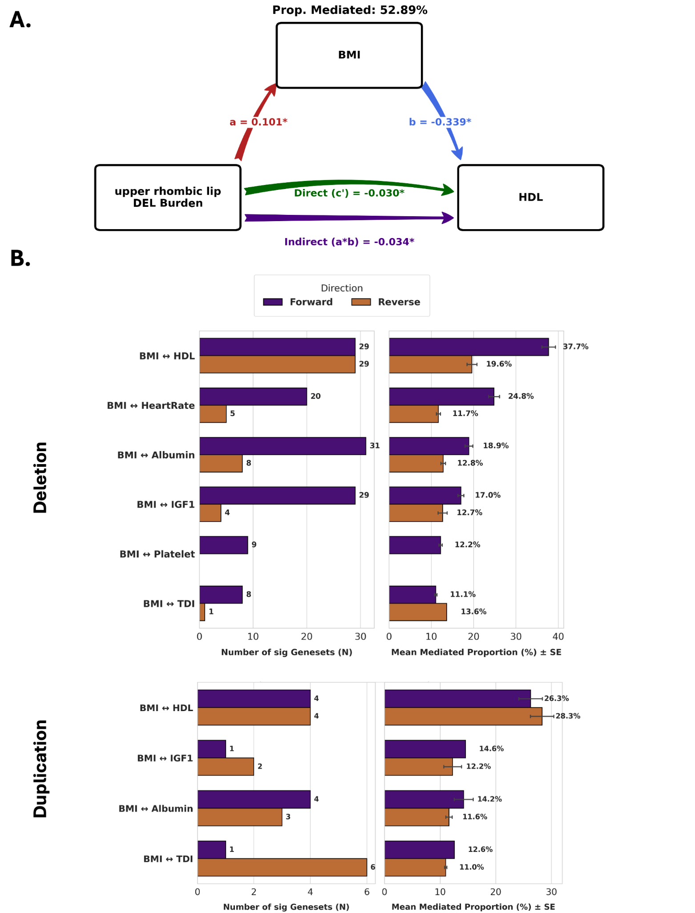

# BMI mediation analysis: direct and mediated pleiotropy

## Why distinguish direct from mediated pleiotropy?

A CNV-burden correlation between two traits can arise through more than one pathway.

- **Direct or biological pleiotropy:** CNV burden influences both traits through shared or parallel biological mechanisms.
- **Mediated pleiotropy:** CNV burden influences one trait, which in turn contributes to the second trait.

For example, a CNV burden associated with body mass index (BMI) could also associate with a blood-assay trait partly because BMI influences that measure. A between-trait CNV-burden correlation alone does not distinguish these possibilities.

```{admonition} Interpretive extension used in this work
:class: tip
The BMI mediation analysis refines the burden-correlation results by separating direct and mediator-compatible pathways for selected trait pairs. It is an application of mediation analysis within the FunBurd framework, not a replacement for the correlation analysis.
```

## What was tested?

We used BMI as a mediator for six trait pairs with CNV-burden correlations greater than 0.3. We performed the analysis separately for deletions and duplications and across FDR-significant gene sets.

For each gene set, the total CNV-burden effect was decomposed into:

- **Path $a$:** effect of CNV burden on BMI;
- **Path $b$:** association of BMI with the outcome trait while accounting for CNV burden;
- **Direct effect $c'$:** effect of CNV burden on the outcome while accounting for BMI;
- **Indirect effect $a \times b$:** component compatible with mediation through BMI.

Analyses were evaluated in both forward and reverse directions.



## Main finding

Across the evaluated trait pairs and gene sets, the direct CNV-burden effect accounted for most of the shared architecture: approximately 84% on average. The mean BMI-mediated proportion was approximately 16%.

The clearest exception was the deletion-driven BMI–HDL relationship, for which the mediated proportion reached 37.7%.

## Interpretation

The mediation analysis suggests that the observed cross-trait sharing is not explained primarily by BMI-mediated pathways, while identifying specific relationships in which mediation is more prominent.

```{admonition} Caution
:class: warning
Mediation analysis does not establish causality by itself. Interpretation depends on the modeled direction and assumptions about unmeasured confounding. Read this analysis as a decomposition of compatible pathways rather than definitive proof of a causal chain.
```

## Related resources

- Supplementary Figure 44
- Supplementary Table ST20
- [CNV-burden correlations across traits](cnv_burden_correlations.md)
- [Assumptions and limitations](../reference/assumptions_limitations.md)

## Next

Continue to [Sex-stratified analyses](sex_stratified.md) or return to [How the pieces fit together](../overview/how_pieces_fit_together.md).
