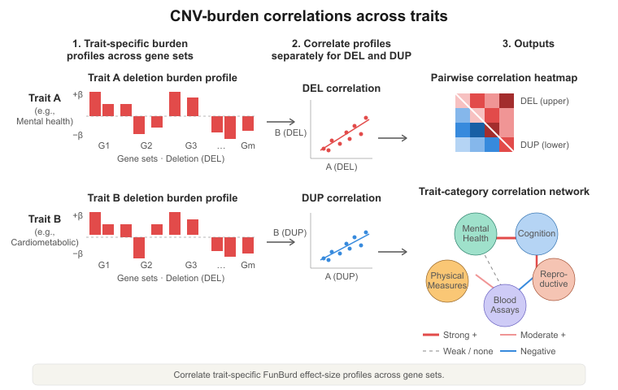
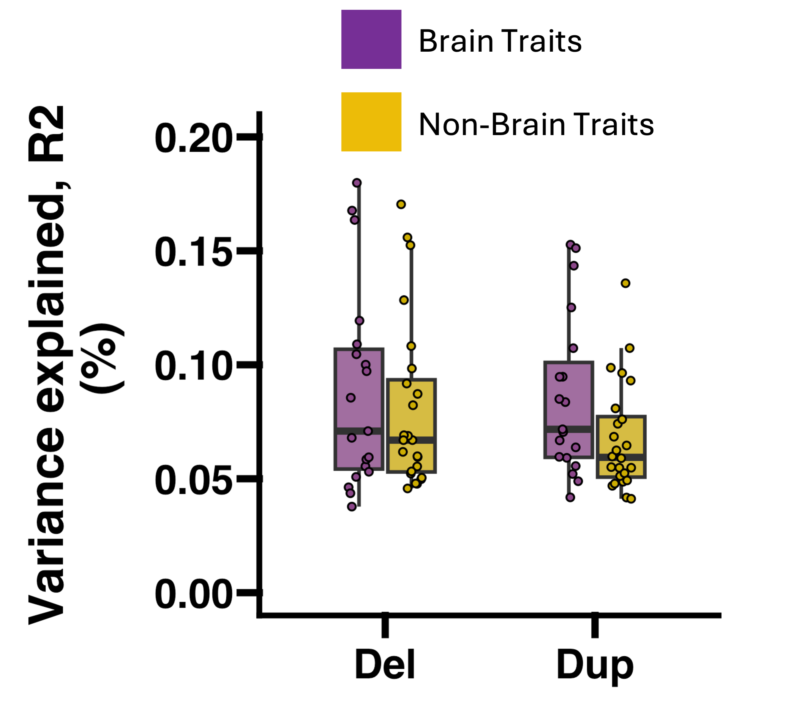
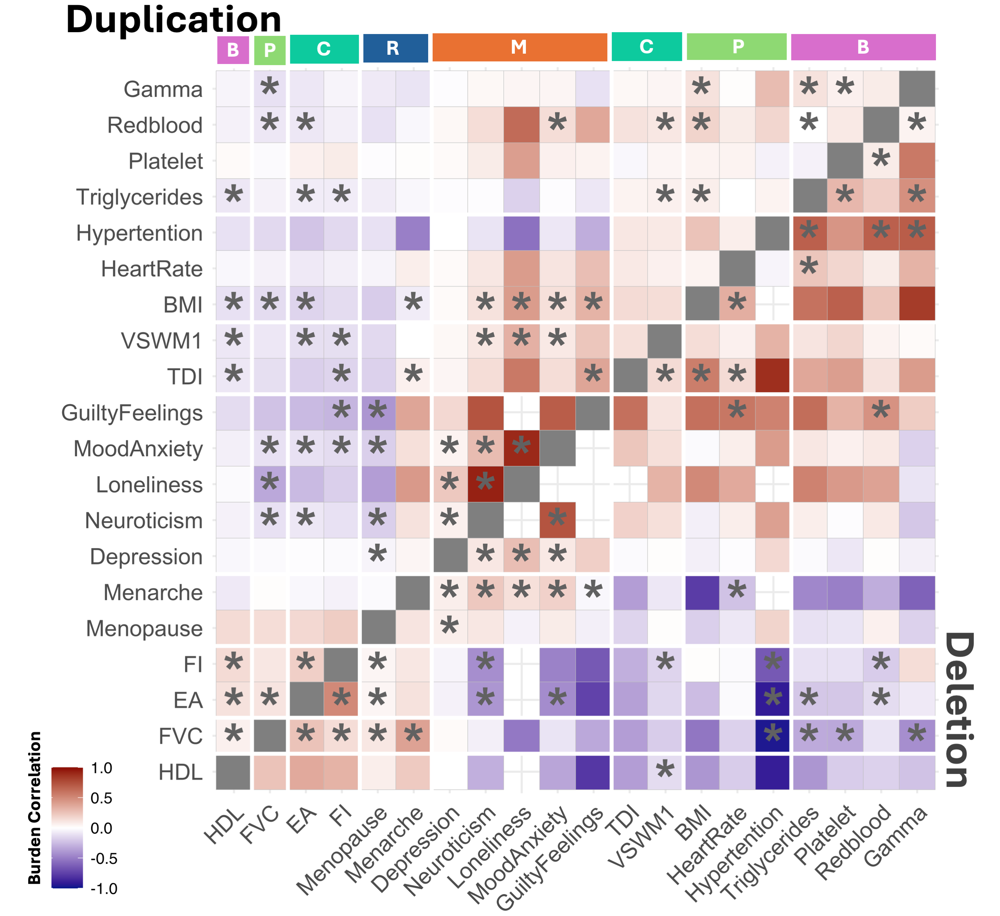
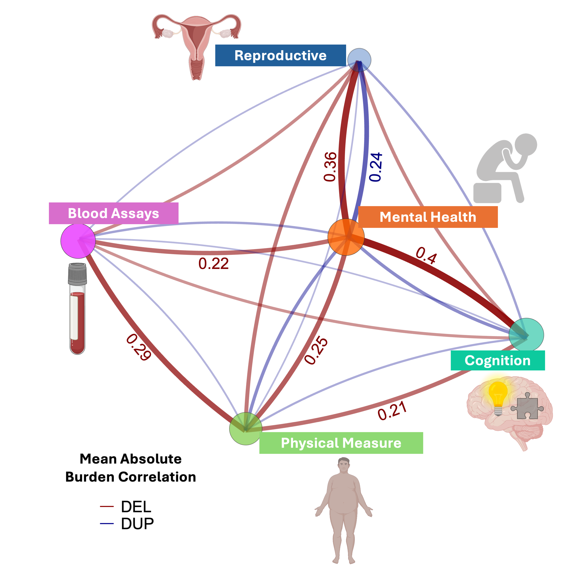
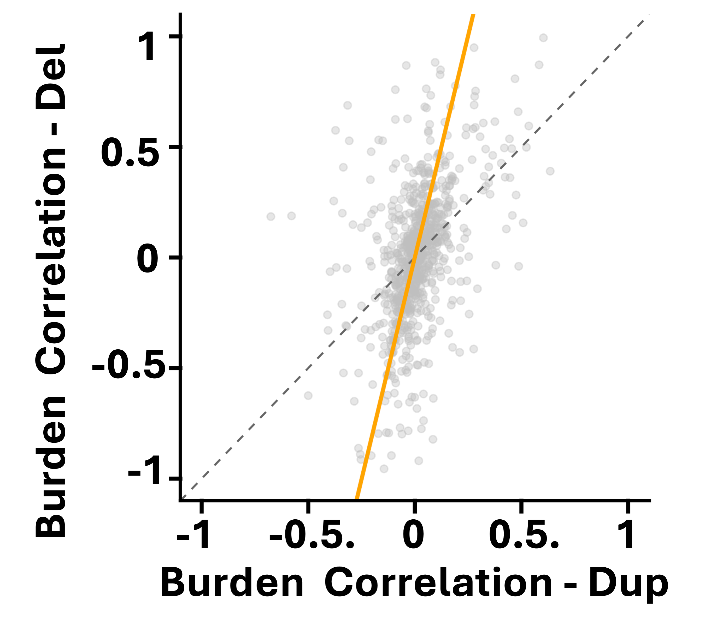
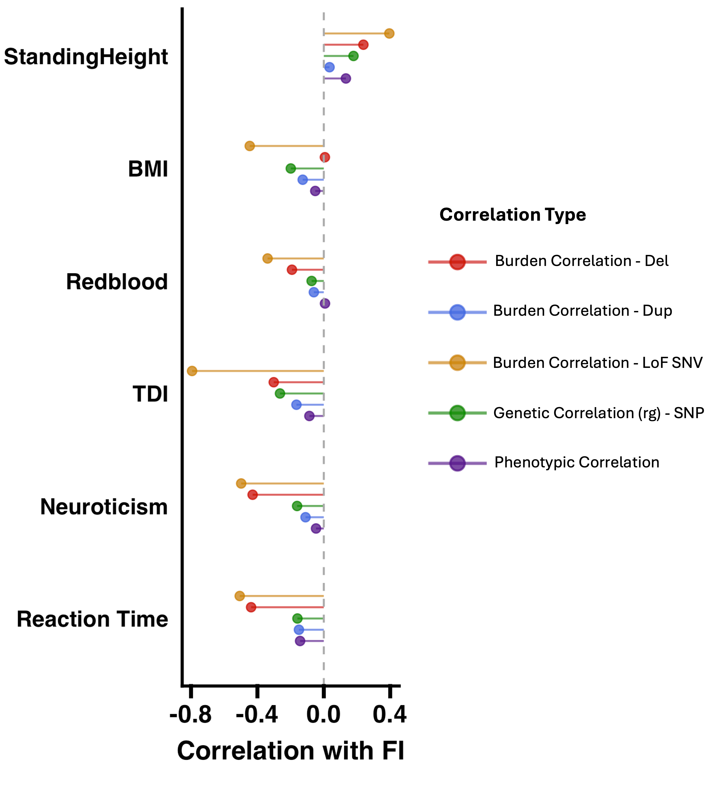

# CNV-burden correlations across traits



## Motivation

Genetic correlation is commonly used to quantify shared architecture between pairs of traits. FunBurd extends this logic to CNVs by comparing trait-specific gene-set burden profiles.

For each trait, FunBurd produces an effect-size profile across functional gene sets. Similarity between the profiles for two traits is summarized separately for deletions and duplications.

```{admonition} CNV extension introduced in this work
:class: tip
We extended cross-trait burden-correlation logic to CNV profiles, allowing deletion and duplication architectures to be compared with each other and with rare loss-of-function and common-variant architectures.
```

## Step-by-step logic

1. Estimate the FunBurd effect-size profile across gene sets for Trait A.
2. Estimate the profile across the same gene sets for Trait B.
3. Reduce redundancy among highly overlapping gene sets.
4. Estimate variance explained by the retained deletion and duplication burden profiles for each trait.
5. Compute deletion- and duplication-burden correlations across trait pairs.
6. Compare the resulting CNV-burden correlations with phenotypic correlations, SNP-based genetic correlations, and rare loss-of-function SNV burden correlations.

## Why filter overlapping gene sets?

Functional gene sets partially overlap. Closely related sets can carry redundant information. This matters when estimating between-trait CNV-burden correlations and the variance explained by CNV burden.

We combined:

- **Jaccard similarity** to quantify pairwise overlap among gene sets;
- **LASSO regularization** to identify gene sets contributing limited independent information across traits.

Gene sets with Jaccard similarity greater than 0.2 that were also removed by LASSO in at least 80% of traits were excluded from the correlation analysis. The accepted manuscript reports that 13 redundant sets were removed, leaving 159 of the original 172 gene sets.

This filtering step is specific to the correlation framework. The primary FunBurd association analysis still evaluates all 172 gene sets.

## How is variance explained estimated?

For each trait and CNV type, the retained burden variables were used in a regression model after accounting for covariates. The coefficient of determination ($R^2$) was extracted as an estimate of variance explained by the effective gene-set burden profile.

These trait-specific variance-explained estimates enter the denominator of the CNV-burden-correlation calculation. The numerator captures covariance between shrinkage-adjusted effect-size profiles across the retained gene sets.

For binary traits, covariates were first removed using logistic regression. Residuals were then treated as continuous outcomes when estimating variance explained, and effect sizes were transformed to the liability scale for comparisons across binary and continuous traits.



```{admonition} Interpretation boundary
:class: note
Variance-explained estimates for CNVs are small. CNV-burden correlations should be interpreted as estimates of shared gene-set-level architecture with uncertainty rather than exact equivalents of common-variant genetic correlations.
```

## Two distinct uses of gene-set overlap

| Procedure | Purpose |
|---|---|
| Jaccard similarity + LASSO filtering | Reduce redundant predictors before estimating variance explained and CNV-burden correlations |
| [P-Jaccard null maps](p_jaccard.md) | Generate overlap-aware null distributions for selected correlation significance tests |

## Publication results

We identified widespread between-trait CNV-burden correlations with distinct deletion and duplication patterns. Deletion-burden correlations were stronger than duplication-burden correlations and were comparable to rare loss-of-function SNV burden correlations.

## Main figure panels







## A cross-variant example

Main Figure 5A provides a useful worked example for one trait pair. It places four quantities side by side:

- phenotypic correlation;
- SNP-based genetic correlation;
- CNV-burden correlation;
- rare loss-of-function SNV burden correlation from Weiner and colleagues.



## Can cross-trait sharing be mediated through BMI?

A high CNV-burden correlation does not necessarily imply that CNV burden acts independently on both traits. For selected trait pairs, we decomposed the total effect into direct and BMI-mediated components.

See [BMI mediation analysis: direct and mediated pleiotropy](bmi_mediation.md).

## Related resources

- Main Figure 5
- Supplementary Figures 42–44 and 53
- Supplementary Tables ST17–ST20
- [P-Jaccard null maps](p_jaccard.md)
- [BMI mediation analysis](bmi_mediation.md)

## Next

Continue to [BMI mediation analysis](bmi_mediation.md).
