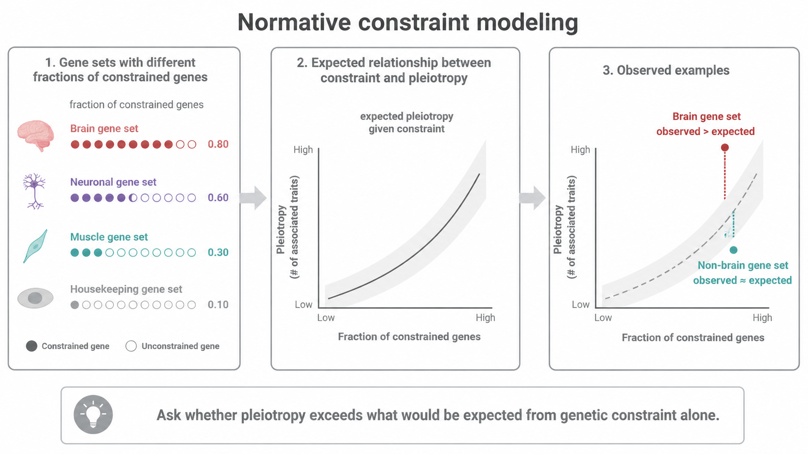
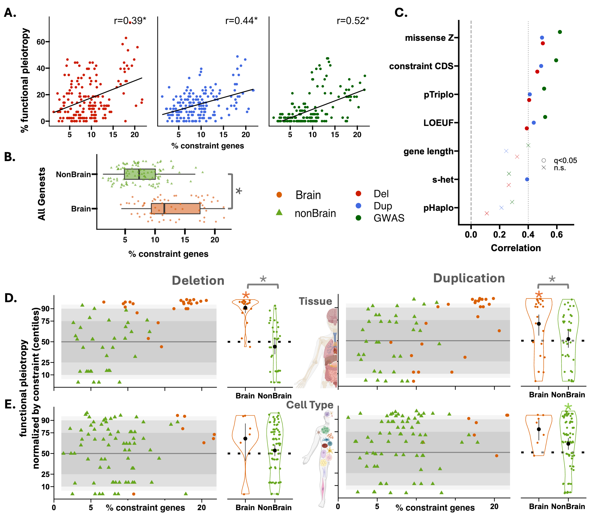

# Normative constraint modeling



## Question

Does a functional gene set show more pleiotropy than would be expected from its genetic constraint alone?

```{admonition} Methodological extension introduced in this work
:class: tip
Normative constraint modeling separates broad intolerance to disruptive variation from function-specific excess pleiotropy. It asks whether biological annotation adds information beyond genetic constraint.
```

## Rationale

A gene set containing many constrained genes may show elevated functional burden pleiotropy because disruptive variants in constrained genes tend to have broader effects. Normative constraint modeling estimates the expected range of pleiotropy for gene sets with a comparable proportion of constrained genes.

## Conceptual workflow

1. Quantify the proportion of constrained genes in each functional gene set.
2. Model the relationship between constraint and pleiotropy across gene sets.
3. Generate an expected pleiotropy range conditional on constraint.
4. Compare the observed pleiotropy of each gene set with that expected range.
5. Identify functions with pleiotropy above or below expectation.

## Interpretation

A gene set with observed pleiotropy above the expected range is more pleiotropic than predicted by constraint alone. This does not identify a single causal gene. It indicates that the function represented by the gene set adds information beyond broad intolerance to disruptive variation.

## Publication result

Most gene sets fell within the expected range. Several sets showed elevated pleiotropy, and brain-related gene sets remained more pleiotropic than non-brain-related sets after constraint normalization.



## Related resources

- Supplementary Table ST16
- [Functional burden pleiotropy and genetic constraint](../evidence/pleiotropy_constraint.md)
- [P-Jaccard null maps](p_jaccard.md)

## Next

Continue to [CNV-burden correlations across traits](cnv_burden_correlations.md).
