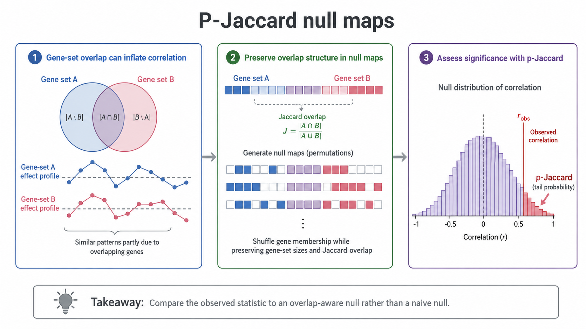

# P-Jaccard null maps



## Why ordinary correlation tests can be misleading

Functional gene sets overlap. Two gene-set-level profiles may therefore appear correlated partly because related sets contain shared genes. Treating gene sets as independent observations can make correlation tests anticonservative.

## Overlap-aware null maps

P-Jaccard uses permutations conditioned on the Jaccard-distance structure between gene sets. The null maps preserve the broad overlap structure while disrupting the relationship being tested.

The observed statistic is compared with this overlap-aware null distribution.

```{admonition} Inference contribution introduced in this work
:class: tip
We use P-Jaccard to address a recurring problem in gene-set-profile analyses: overlapping sets can inflate apparent correlations. P-Jaccard changes the reference distribution used for inference rather than treating the sets as independent.
```

## Where is P-Jaccard used?

We use P-Jaccard when assessing selected correlations involving gene-set-level profiles, including:

- correlations between genetic constraint and functional burden pleiotropy;
- cross-cohort concordance of effect-size profiles;
- comparisons between deletion burden and aggregated predicted loss-of-function burden;
- selected cross-architecture comparisons.

## What P-Jaccard does not do

P-Jaccard does not remove overlap from the observed data and does not replace redundancy filtering when fitting multivariable models. It provides an overlap-aware null for significance testing.

For the distinct use of Jaccard overlap and LASSO regularization before estimating CNV-burden correlations, see [CNV-burden correlations](cnv_burden_correlations.md).

## Where this fits in the framework

P-Jaccard is a load-bearing inference component for downstream correlation-based claims. It should be understood before interpreting constraint–pleiotropy correlations, cross-cohort profile concordance, or deletion-versus-pLoF profile comparisons.

## Related resources

- Supplementary Table ST3: pairwise Jaccard overlap
- Supplementary Table ST15: constraint–pleiotropy correlation statistics
- [How the pieces fit together](../overview/how_pieces_fit_together.md)
- [How are functional gene sets created?](../concepts/functional_gene_sets.md)

## Next

Continue to [Why trust the framework?](../evidence/robustness_checks.md) for validation evidence or [Normative constraint modeling](normative_constraint_modeling.md) for an advanced application.
