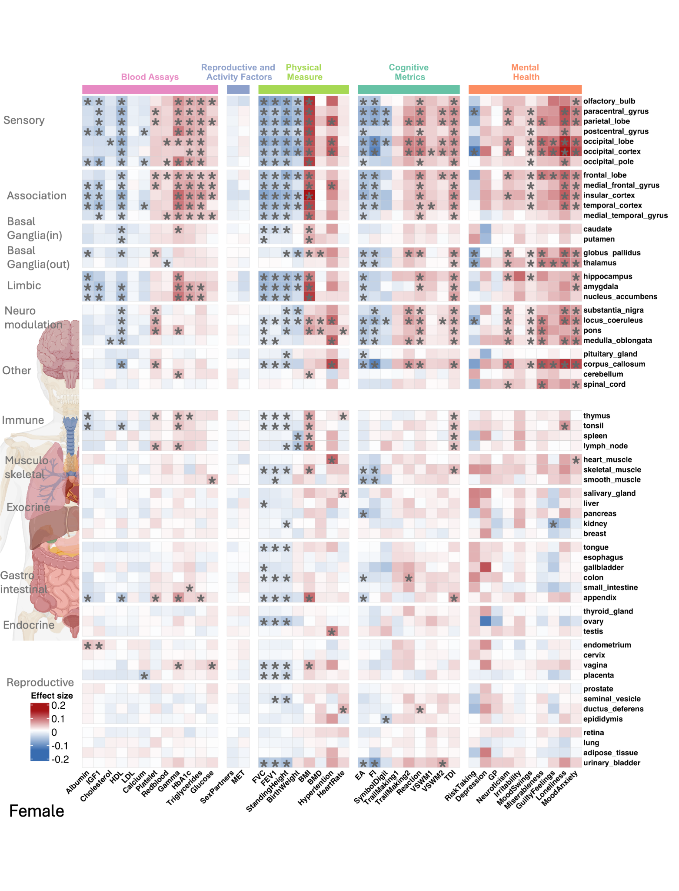
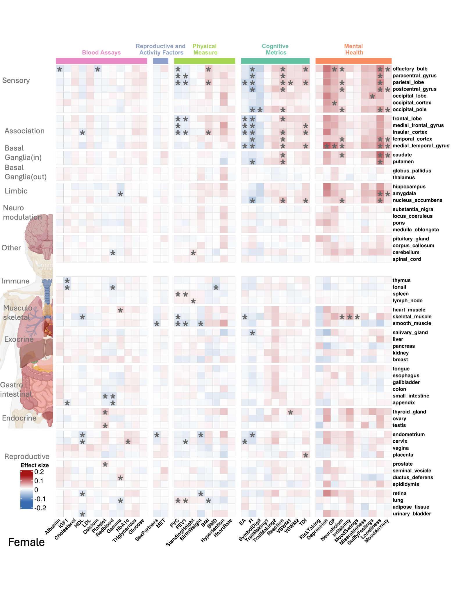
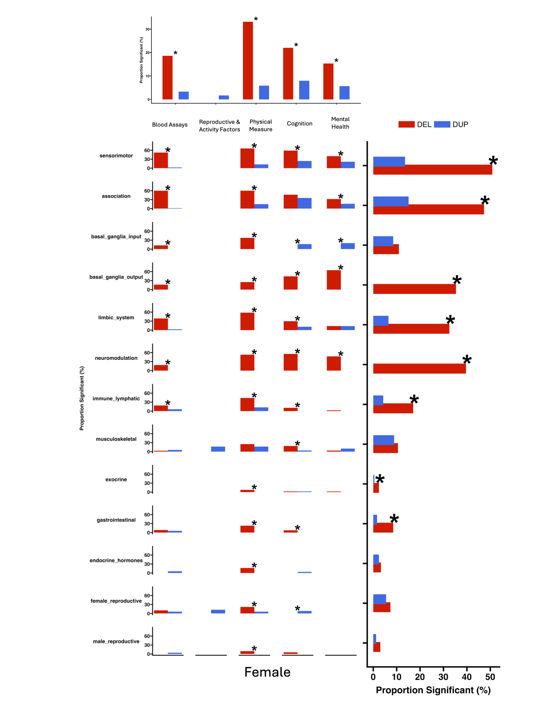

# Sex-stratified analyses

## Why stratify by sex?

Sex differences can influence the genetic architecture and observed prevalence of complex traits, particularly mental-health outcomes. We therefore repeated FunBurd analyses separately in female and male participants.

## Main finding

Overall association patterns were broadly similar across sexes. For mental-health traits, female participants showed a higher proportion of deletion associations than male participants, driven primarily by mood-swings and mood/anxiety phenotypes.

## Interpretation boundary

The stratified analyses describe differences in discovered association patterns. They do not, by themselves, establish a formal sex-by-CNV interaction for every highlighted gene-set–trait pair. Differences in phenotype prevalence, power, and ascertainment may contribute.

## Related resources

- Supplementary Figures 20–25 and 32–37
- Supplementary Tables ST11 and ST12
- [Sensitivity-analysis index](sensitivity_index.md)
