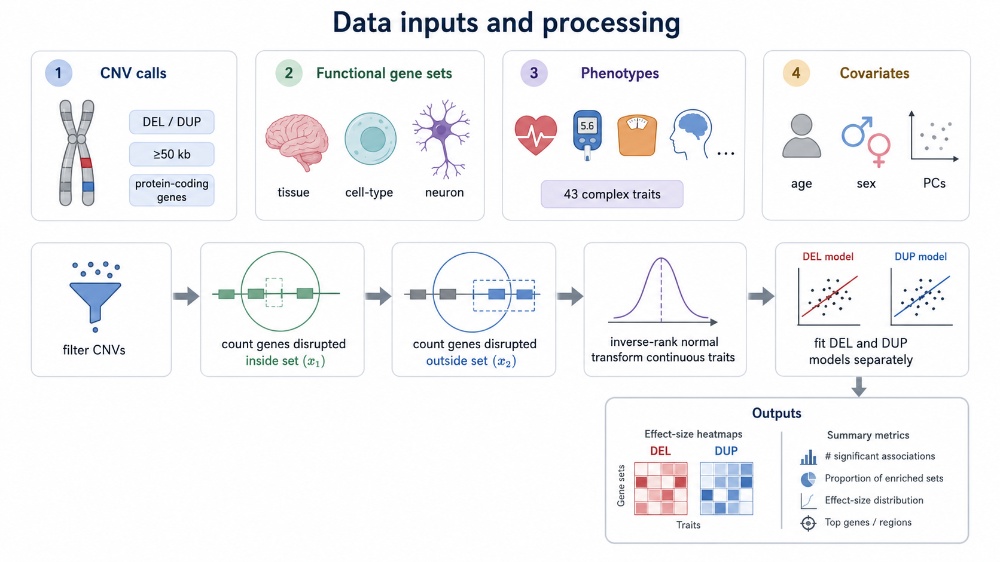
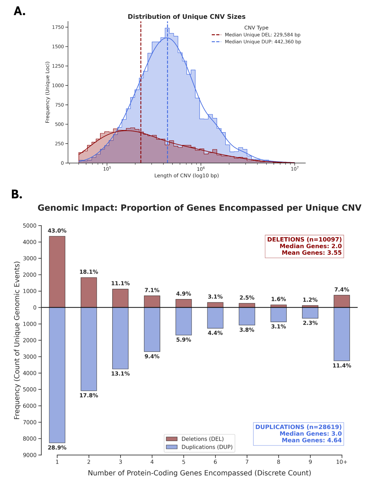

# What data enter a FunBurd analysis?

FunBurd requires four core inputs: CNV calls, CNV-to-gene annotations, functional gene sets, and phenotypes with covariates.

## 1. CNV calls

In our primary analysis, we included deletions and duplications that:

- were at least 50 kb in length;
- fully encompassed at least one protein-coding gene;
- passed the CNV quality-control pipeline.

Deletions and duplications are analyzed separately.

Among unique CNVs in the primary analysis, 43.0% of deletions and 28.9% of duplications encompassed one protein-coding gene. The median number of encompassed genes was two for deletions and three for duplications.

## 2. CNV-to-gene annotations

The CNV-to-gene table maps each CNV interval to the genes it encompasses. In the lightweight example, the main fields are:

| Column | Meaning |
|---|---|
| `gene_id` | Ensembl gene identifier |
| `CHR` | Chromosome |
| `START` | CNV start position |
| `STOP` | CNV stop position |
| `TYPE` | `DEL` or `DUP` |
| `proportion_gene_overlap` | Proportion of the gene overlapped by the CNV |

The toy implementation retains rows with `proportion_gene_overlap >= 1`, corresponding to genes fully encompassed by a CNV.

## 3. Functional gene sets

Each gene-set file contains the Ensembl identifiers assigned to a tissue or cell type. See [How are functional gene sets created?](functional_gene_sets.md).

## 4. Phenotypes and covariates

We analyzed 43 complex traits across five categories:

- blood assays;
- reproductive and activity factors;
- physical measures;
- cognitive metrics;
- mental-health measures.

Continuous phenotypes were inverse-rank normal transformed. The main models adjusted for age, sex, and ten ancestry principal components.

## Why use inverse-rank normal transformation?

Inverse-rank normal transformation reduces sensitivity to outliers and non-normal trait distributions. It also supports comparison with large-scale UK Biobank analyses of common and rare variants using related phenotype-processing strategies.

## Applying the method beyond our study dataset

You can adapt FunBurd to other cohorts, CNV call sets, and gene-set resources, but each extension should be treated as a new validation exercise. In particular, partial-gene overlaps, WGS-based CNV calls, alternative CNV-size thresholds, and alternative gene-set definitions may change the burden variables and the resulting interpretation.

See [Applying FunBurd to a new dataset](../using_funburd/apply_to_your_data.md).

## Next

Continue to [How should a FunBurd association be interpreted?](interpreting_associations.md).
