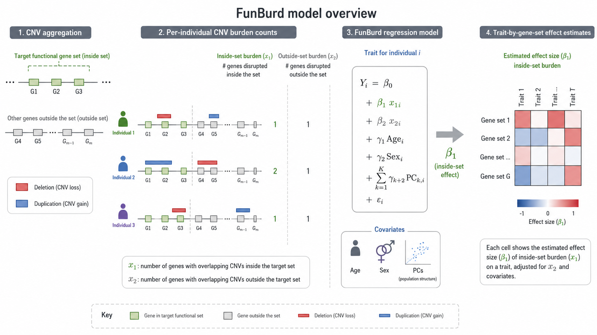

# How does the FunBurd model work?



## Core idea

For each participant and each target [functional gene set](../reference/glossary.md#term-functional-gene-set), FunBurd counts the number of genes disrupted by CNVs **inside** the set and the number disrupted **outside** the set. Deletions and duplications are modeled separately.

For an individual $i$, the continuous-trait model can be summarized as:

$$
Y_i = \beta_0 + \beta_1 x_{1i} + \beta_2 x_{2i} + \gamma_1\mathrm{Age}_i + \gamma_2\mathrm{Sex}_i + \sum_{k=1}^{10}\gamma_{k+2}\mathrm{PC}_{k,i} + \epsilon_i.
$$

## What do the terms mean?

| Term | Interpretation |
|---|---|
| $Y_i$ | Trait value for participant $i$ |
| $x_{1i}$ | Number of CNV-disrupted genes **inside** the target functional gene set |
| $x_{2i}$ | Number of CNV-disrupted genes **outside** the target functional gene set |
| $\beta_1$ | Average association of one additional disrupted gene inside the target set |
| $\beta_2$ | Association of disrupted genes outside the target set; this adjusts for broader multigenic CNV burden |
| Covariates | Age, sex, and ten ancestry principal components |

The parameter of primary interest is $\beta_1$. The outside-set term $x_2$ is essential because a CNV may encompass genes both inside and outside the target set. Including $x_2$ reduces confounding from the broader genomic burden of multigenic CNVs.

```{admonition} Core methodological contribution
:class: tip
The inside-set and outside-set decomposition is the central FunBurd design choice. It estimates the average association attributable to a target function while adjusting for the broader coding burden carried by the same CNVs.
```

## Deletions and duplications are analyzed separately

For each functional gene set and trait, FunBurd fits:

- a deletion model using `inside_DEL` and `outside_DEL`;
- a duplication model using `inside_DUP` and `outside_DUP`.

This design supports later comparison of deletion-specific, duplication-specific, monotonic, and non-monotonic patterns.

## Why use a linear model?

The burden variable $x_1$ is sparse and Poisson-like. Most participants do not carry a CNV disrupting genes in a given set, and most carriers disrupt only one or two genes in that set. Under this distribution, the available data provide limited power to distinguish a linear function from more complex gene-set-level curves.

The primary linear model is therefore a parsimonious **average-effect model**. It should not be interpreted as proof that biological responses are intrinsically linear.

## Binary traits

For binary outcomes, the lightweight implementation uses Firth logistic regression to reduce separation-related bias. For continuous outcomes, it uses a linear model.

```{admonition} Interpretation boundary
:class: warning
A significant $\beta_1$ identifies a functional gene set whose members are, on average, sensitive to altered dosage for a trait. It does not establish a causal tissue, a causal cell type, or a single causal gene.
```

## Related resources

- [Data inputs and processing](data_inputs.md)
- [How should a FunBurd association be interpreted?](interpreting_associations.md)
- [Assumptions and limitations](../reference/assumptions_limitations.md)
- Supplementary Table ST4: complete inside-set and outside-set estimates

## Next

Continue to [How are functional gene sets created?](functional_gene_sets.md).
