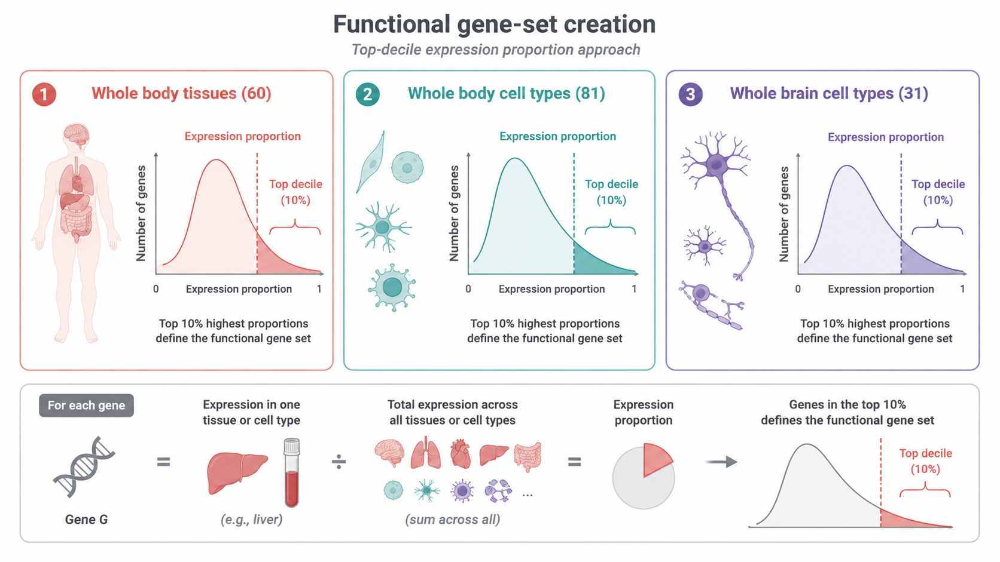
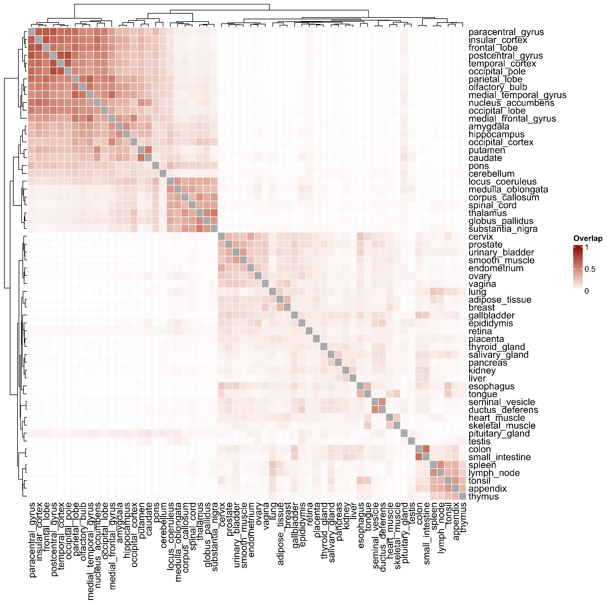

# How are functional gene sets created?

## Top-decile expression proportion approach

FunBurd uses preferential expression to assign genes to tissues or cell types. For each gene, expression in one tissue or cell type is divided by its total expression across the relevant resource:

$$
\mathrm{Expression\ proportion}_{g,s} =
\frac{\mathrm{Expression\ of\ gene\ }\,g\,\mathrm{\ in\ source\ }\,s}
{\sum_j \mathrm{Expression\ of\ gene\ }\,g\,\mathrm{\ across\ sources\ }\,j}.
$$

Genes in the top decile of the expression-proportion distribution for a tissue or cell type define that functional gene set. This approach is referred to as the **top-decile expression proportion** or **TDEP** approach.

## Gene-set collections

The primary analysis includes 172 functional gene sets:

| Collection | Number of gene sets | Resolution |
|---|---:|---|
| Whole-body tissues | 60 | Tissue-level functions across the body and brain |
| Whole-body cell types | 81 | Finer cell-type resolution across organ systems |
| Adult whole-brain cell types | 31 | Neuronal and non-neuronal brain-cell populations |

The tissue-level sets are broad and interpretable. The cell-type sets provide finer resolution while retaining reasonably comparable gene-set sizes.

## Why not use pathway collections as the primary sets?

Pathway resources such as Gene Ontology contain gene sets with highly variable sizes. This complicates direct comparison of association strength and power across sets. The primary analysis therefore prioritizes expression-defined tissue and cell-type sets.

## Gene-set overlap

Functional gene sets are not independent. A gene can be preferentially expressed in more than one related tissue or cell type. In the whole-body tissue collection, the mean pairwise overlap was 7.9%, with a median of 2.7%.

Overlap is handled explicitly in downstream analyses. See:

- [P-Jaccard null maps](../advanced_methods/p_jaccard.md) for overlap-aware inference;
- [CNV-burden correlations](../advanced_methods/cnv_burden_correlations.md) for redundancy filtering with Jaccard overlap and LASSO.

## Related resources

- Supplementary Table ST2: gene-set membership matrix
- Supplementary Table ST3: pairwise Jaccard overlap between all 172 gene sets
- [Glossary](../reference/glossary.md)

## Next

Continue to [What data enter a FunBurd analysis?](data_inputs.md).
