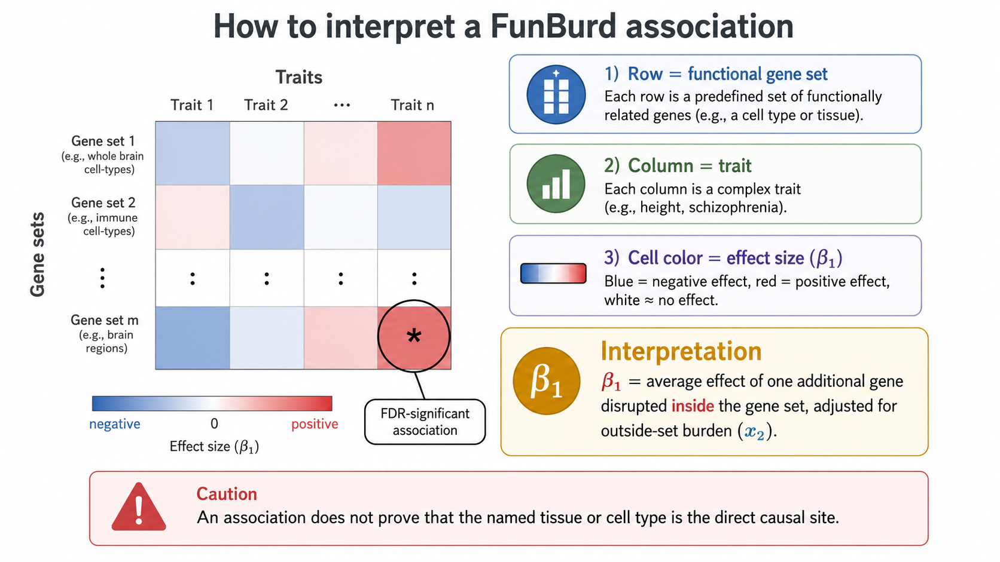
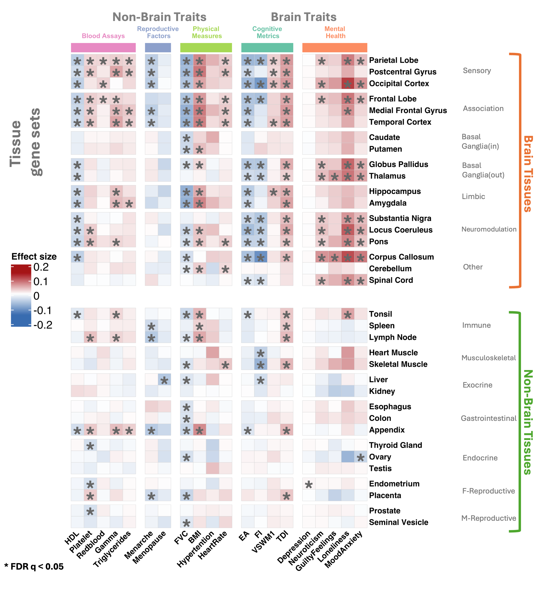
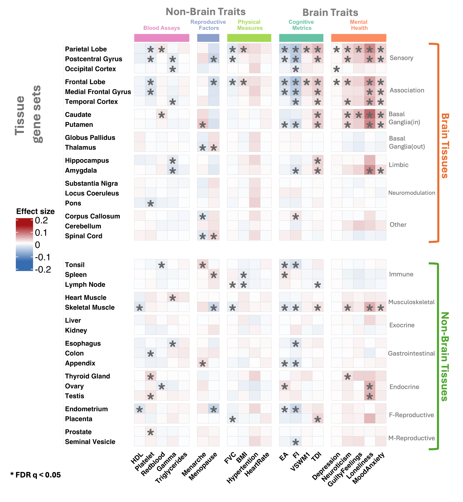

# How should a FunBurd association be interpreted?



## Reading an association heatmap

A FunBurd heatmap summarizes gene-set–trait associations:

- each **row** is a functional gene set;
- each **column** is a trait;
- each **cell color** represents the estimated inside-set effect size, $\beta_1$;
- an asterisk denotes an association that survives the specified multiple-testing correction.

Deletion and duplication heatmaps should be interpreted separately.

## Interpreting $\beta_1$

For a continuous trait, $\beta_1$ is the average association of one additional CNV-disrupted gene inside the target functional set, adjusted for genes disrupted outside the set and for model covariates.

For example, a positive deletion-burden estimate means that participants carrying deletions encompassing more genes in the target set tend to show a higher transformed trait value after adjustment for outside-set deletion burden and covariates.

## Multiple-testing correction

In our primary analysis, we tested:

$$
172\ \mathrm{gene\ sets} \times 43\ \mathrm{traits} \times 2\ \mathrm{CNV\ types} = 14{,}792\ \mathrm{tests}.
$$

Associations were evaluated after Benjamini–Hochberg false-discovery-rate correction.





```{admonition} Caution
:class: warning
A significant association indicates that genes with preferential expression in the named tissue or cell type are, on average, sensitive to dosage change for that trait. It does not necessarily imply that the named tissue or cell type is the proximal causal mechanism.
```

## Related resources

- Supplementary Table ST4: complete association estimates
- [Glossary](../reference/glossary.md)
- [Why trust the framework?](../evidence/robustness_checks.md)
- [Assumptions and limitations](../reference/assumptions_limitations.md)

## Next

To decide whether the method fits a new project, continue to [Applying FunBurd to a new dataset](../using_funburd/apply_to_your_data.md). To evaluate the evidence supporting our findings, continue to [Why trust the framework?](../evidence/robustness_checks.md).
