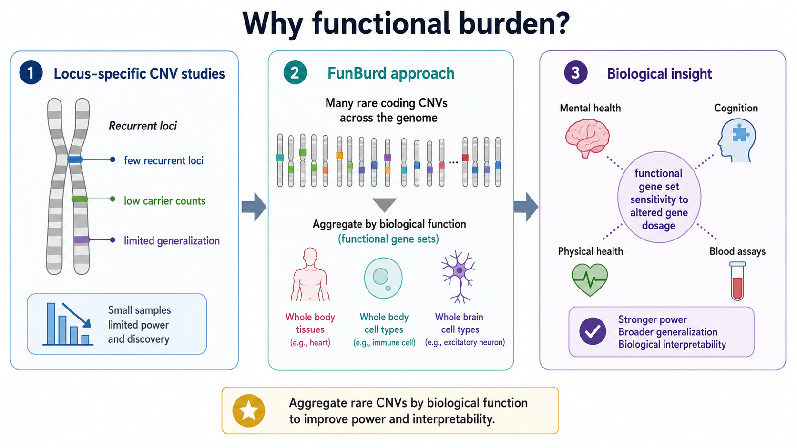

# Why functional burden?



## The problem with locus-level analysis alone

Copy-number variants (CNVs) can have large effects because deletions and duplications alter the dosage of genes they encompass. However, most coding CNVs are rare. Locus-level association studies therefore concentrate on a small number of recurrent CNVs with sufficient carrier counts.

That strategy is valuable but incomplete. It leaves much of the coding genome outside systematic analysis and makes it difficult to identify biological functions that are sensitive to altered dosage across many rare CNVs.

## The FunBurd strategy

FunBurd aggregates rare coding CNVs by the biological functions of the disrupted genes. In our study, we represented function using expression-defined gene sets for:

- whole-body tissues;
- whole-body cell types;
- adult whole-brain cell types.

We ask whether participants with CNVs disrupting more genes in a functional set tend to differ in a trait, after accounting for genes disrupted outside that set.

```{admonition} Core methodological contribution
:class: tip
With FunBurd, we move the analysis unit from a recurrent CNV locus to a biological function. This improves power to study distributed rare coding CNVs while retaining an interpretable link to gene dosage.
```

## What FunBurd can and cannot answer

FunBurd can identify functional gene sets whose members are, on average, sensitive to altered dosage for a trait. It can compare deletion and duplication patterns and quantify cross-trait sharing.

FunBurd does not establish that every gene in a set has the same effect, identify a single causal gene, or prove that the named tissue or cell type is the proximal site of action.

## Next

Continue to [How does the FunBurd model work?](funburd_model.md).
