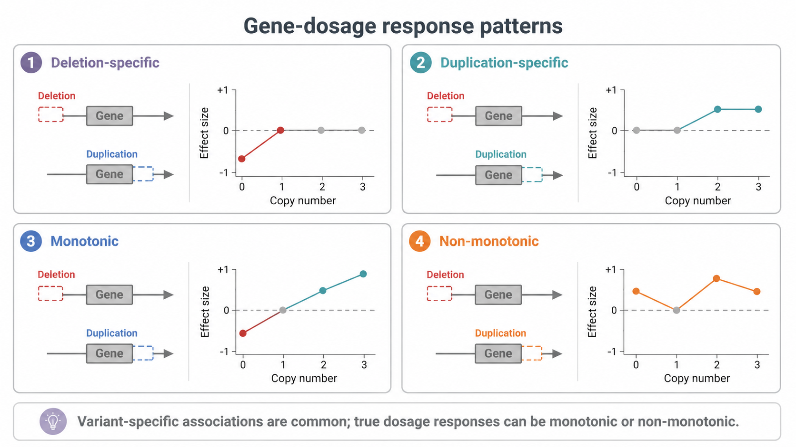
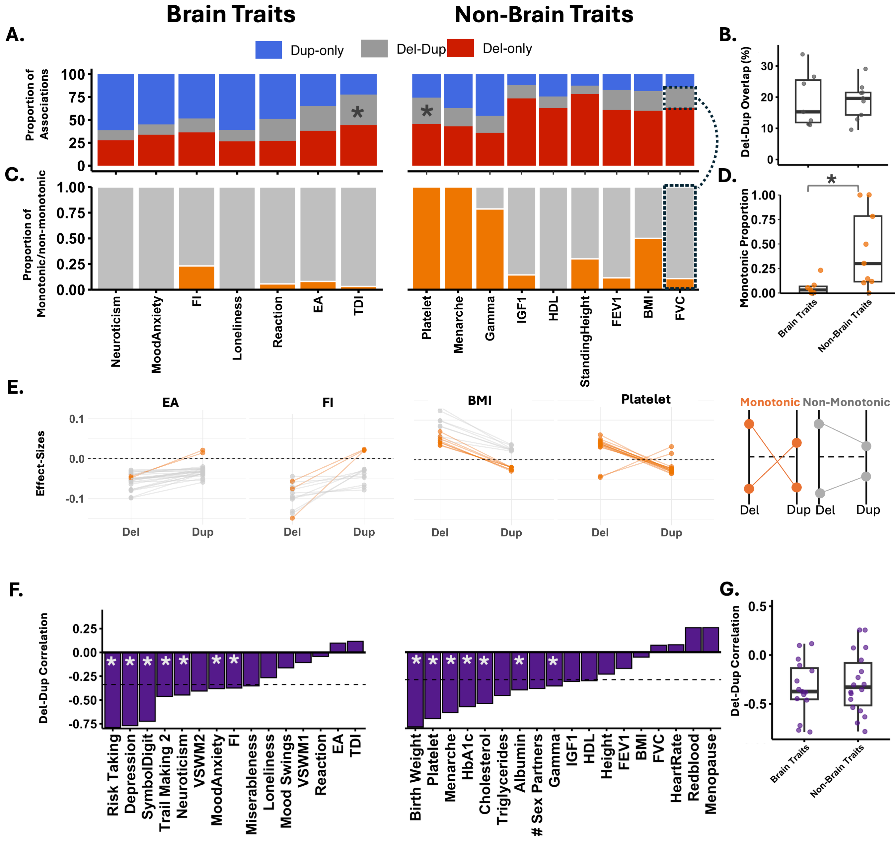
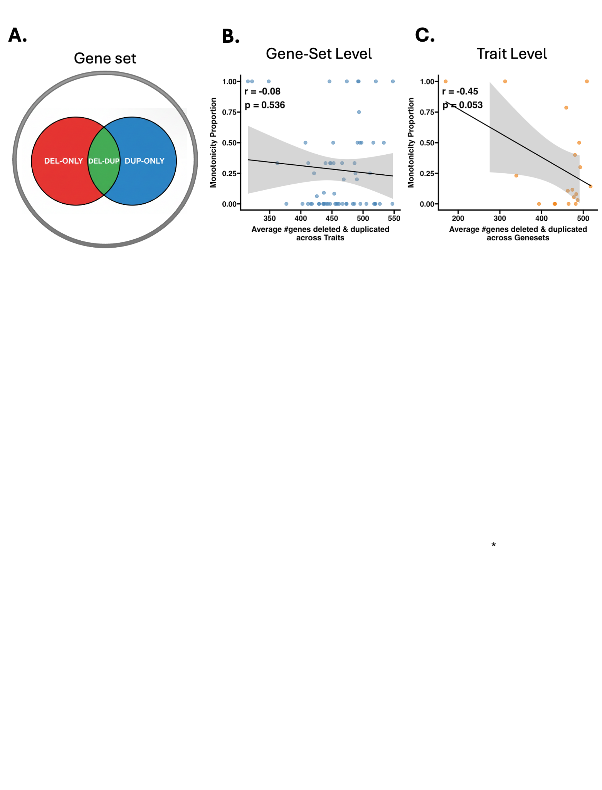
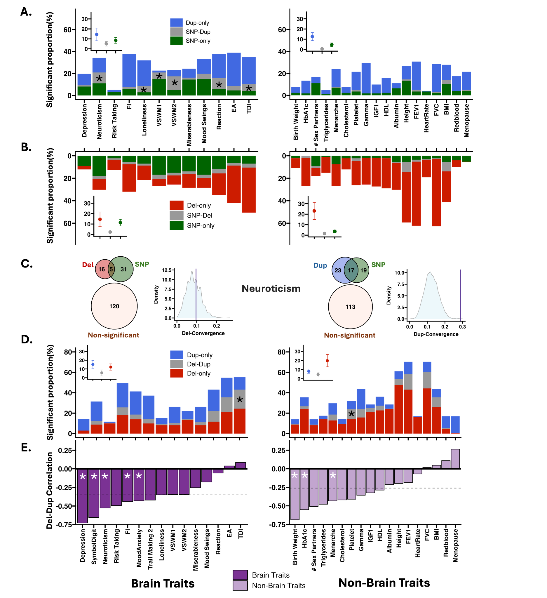

# Gene-dosage responses and variant specificity



## Why compare deletions and duplications?

Deletions and duplications represent two classes of variants with opposing effects on gene expression. This makes them informative for testing whether trait responses follow a simple monotonic dosage model.

## Four useful patterns

| Pattern | Interpretation |
|---|---|
| Deletion-specific | The functional association is detected for deletions but not duplications |
| Duplication-specific | The functional association is detected for duplications but not deletions |
| Monotonic | Deletion and duplication effects point in opposite directions |
| Non-monotonic | Deletion and duplication effects point in the same direction |

A **true gene-dosage response** is a gene-set–trait pair for which deletion and duplication burden associations are both FDR-significant.

```{admonition} Analytical contribution
:class: tip
We separate two questions that are often conflated: whether a function is associated with one or both CNV classes, and whether the subset associated with both follows a monotonic or non-monotonic pattern.
```

## Main findings

Among true gene-dosage responses, non-monotonic responses were more frequent than monotonic responses. We identified 183 same-direction non-monotonic responses and 62 opposing-direction monotonic responses.

Across all significant functional associations, 85% were observed for deletions or duplications rather than both. Most traits also showed negative correlations between deletion and duplication effect sizes across functional gene sets.



## Could the pattern arise because deletions and duplications hit different genes?

Genes affected by deletions and duplications overlapped substantially within functional sets. The extent of overlap was not correlated with monotonicity, arguing against the idea that non-monotonicity is merely an artifact of entirely different genes being disrupted by each CNV type.



## Comparison with common variants

We also tested whether gene sets associated with CNVs overlapped with gene sets enriched for common-variant signal. Significant overlaps were observed for duplications and common variants for several brain traits, but not for deletions and common variants.



## Interpretation boundary

A non-monotonic pattern at the gene-set level does not imply that every gene within the set has the same nonlinear dosage curve. FunBurd estimates average gene-set-level responses across distributed CNVs.

## Related resources

- Supplementary Tables ST16 and ST19
- [Assumptions and limitations](../reference/assumptions_limitations.md)

## Next

Continue to the advanced extensions: [Normative constraint modeling](../advanced_methods/normative_constraint_modeling.md) and [CNV-burden correlations](../advanced_methods/cnv_burden_correlations.md).
