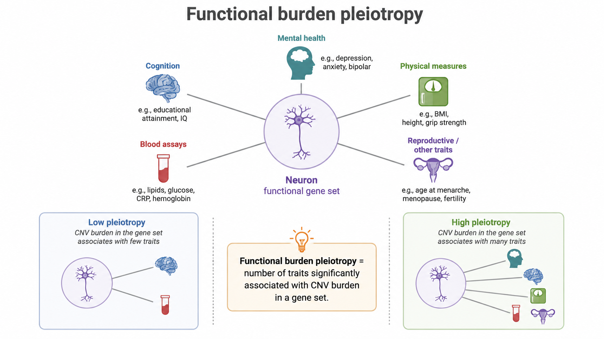

# Functional burden pleiotropy and genetic constraint



## What is functional burden pleiotropy?

Classically, pleiotropy describes a gene or variant influencing multiple traits. FunBurd extends this idea to functional gene sets.

**Functional burden pleiotropy** is the number of traits significantly associated with CNV burden in a functional gene set.

```{admonition} Terminological contribution
:class: tip
Functional burden pleiotropy is intentionally broader than classical single-variant pleiotropy. It captures gene-set-level convergence across distinct rare CNVs disrupting genes with a shared functional annotation.
```

## Why examine genetic constraint?

Genes under stronger genetic constraint are less tolerant of disruptive variation. A gene set containing many constrained genes may therefore show more pleiotropic associations even if its specific biological annotation contributes no additional information.

We asked two questions:

1. Is functional burden pleiotropy correlated with the proportion of constrained genes in a set?
2. Do some functions remain more pleiotropic than expected after accounting for constraint?

## Main finding

Gene sets with a higher proportion of constrained genes showed higher pleiotropy. Brain-related gene sets were also more constrained than non-brain-related sets. However, brain-related functions remained more pleiotropic after normalization for constraint.


## Why this matters

Constraint is not merely a nuisance covariate. It is an important biological determinant of CNV sensitivity. At the same time, the residual enrichment of brain-related functions suggests that biological annotation adds information beyond constraint alone.

## Related resources

- [Normative constraint modeling](../advanced_methods/normative_constraint_modeling.md)
- Supplementary Tables ST15 and ST16
- [Assumptions and limitations](../reference/assumptions_limitations.md)

## Next

Continue to [Gene-dosage responses and variant specificity](gene_dosage_responses.md) or read the advanced [Normative constraint modeling](../advanced_methods/normative_constraint_modeling.md) page.
