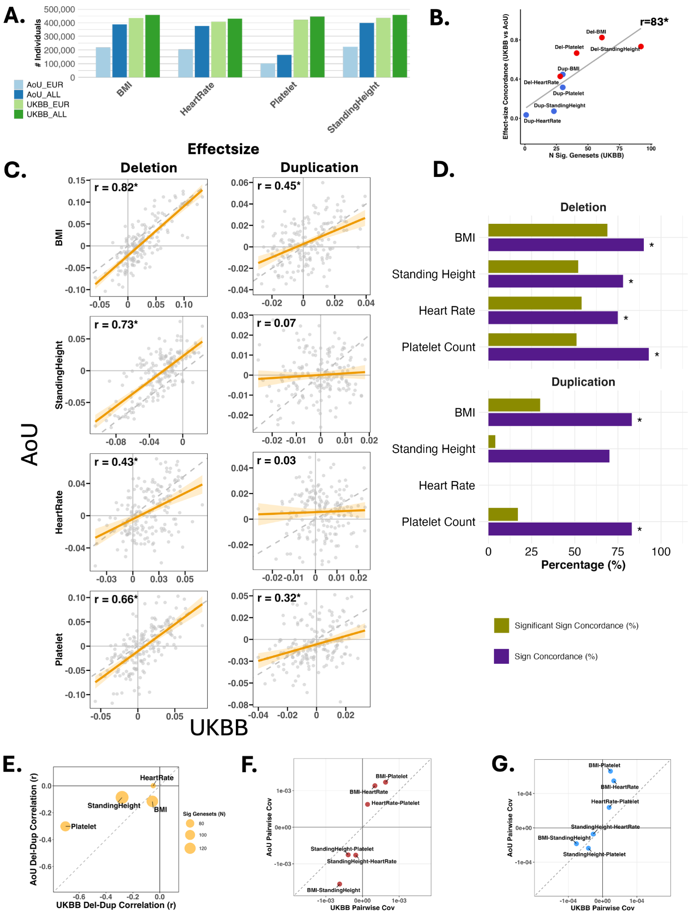
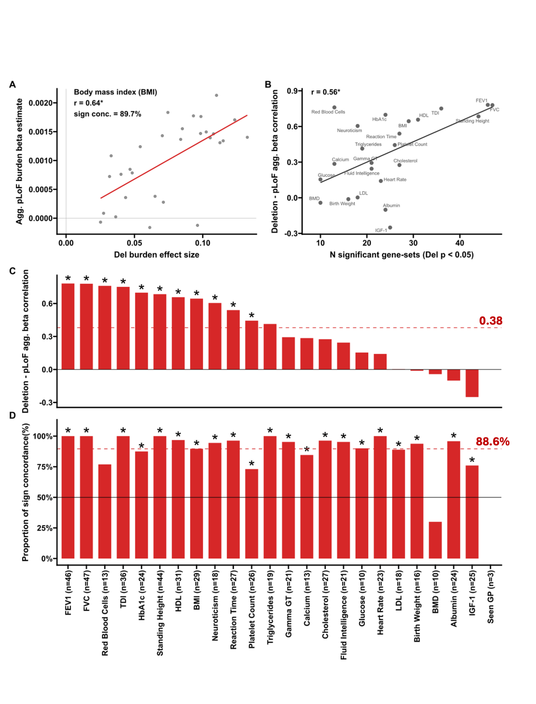
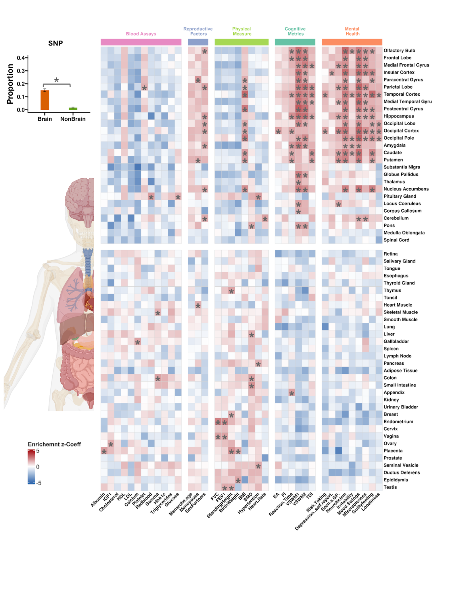

# Do the findings replicate and generalize across variant classes?

## Replication in All of Us

We tested BMI, standing height, heart rate, and platelet count in the All of Us cohort using comparable phenotype definitions and the same broad FunBurd logic.

Deletion-burden effect-size profiles showed strong cross-cohort concordance, particularly for better-powered traits. Duplication concordance was weaker, consistent with lower effective power for duplication associations.

## Comparison with aggregated predicted loss-of-function burden

Deletions and predicted loss-of-function variants are distinct classes of variation, but both can reduce gene dosage or function. Comparing their gene-set-level association profiles provides orthogonal support for the deletion results.

We observed high sign concordance between deletion-burden and aggregated predicted loss-of-function-burden effects across available traits.

## Comparison with common variants

We also used stratified linkage-disequilibrium score regression (S-LDSC) to estimate common-variant heritability enrichments for the same functional gene sets and traits.

S-LDSC and FunBurd should not be treated as interchangeable estimators. They provide related views of functional architecture across different variant classes.

## Why use several validation routes?

No single comparison is sufficient:

- All of Us asks whether CNV-burden profiles replicate in another cohort;
- predicted loss-of-function burden asks whether deletion effects agree with an orthogonal loss-of-function architecture;
- S-LDSC asks how rare coding CNV signals compare with common-variant enrichment patterns.

## Related resources

- Supplementary Tables ST8–ST10 and ST13
- [P-Jaccard null maps](../advanced_methods/p_jaccard.md)
- [CNV-burden correlations](../advanced_methods/cnv_burden_correlations.md)

## Next

Continue to [Functional burden pleiotropy and genetic constraint](pleiotropy_constraint.md).
