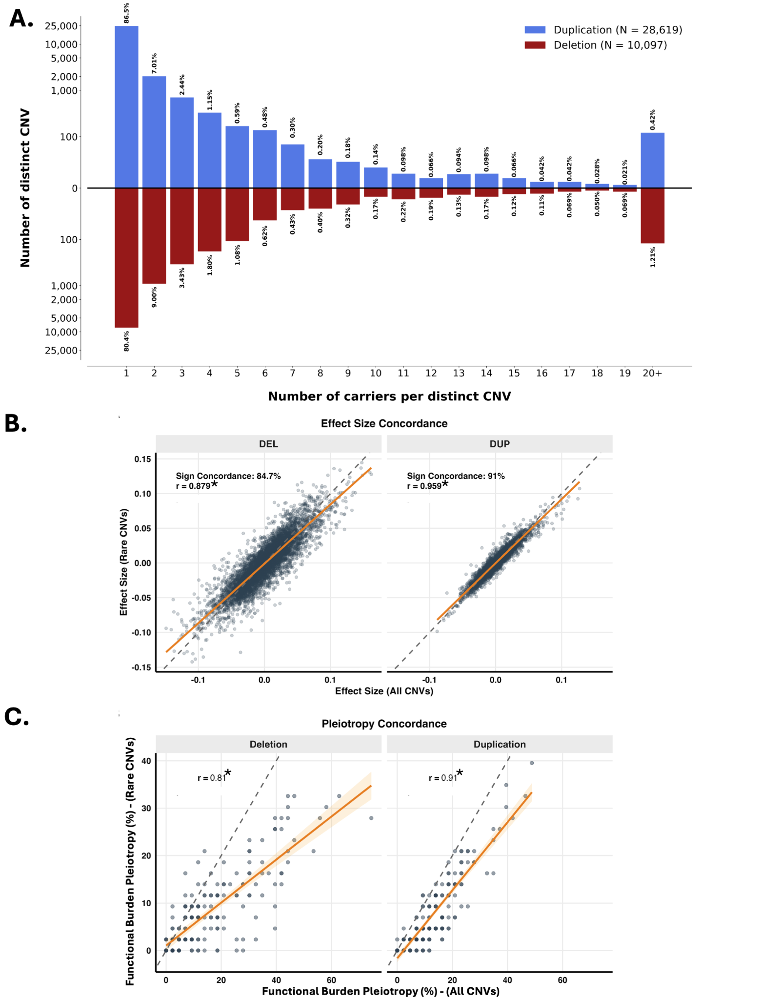
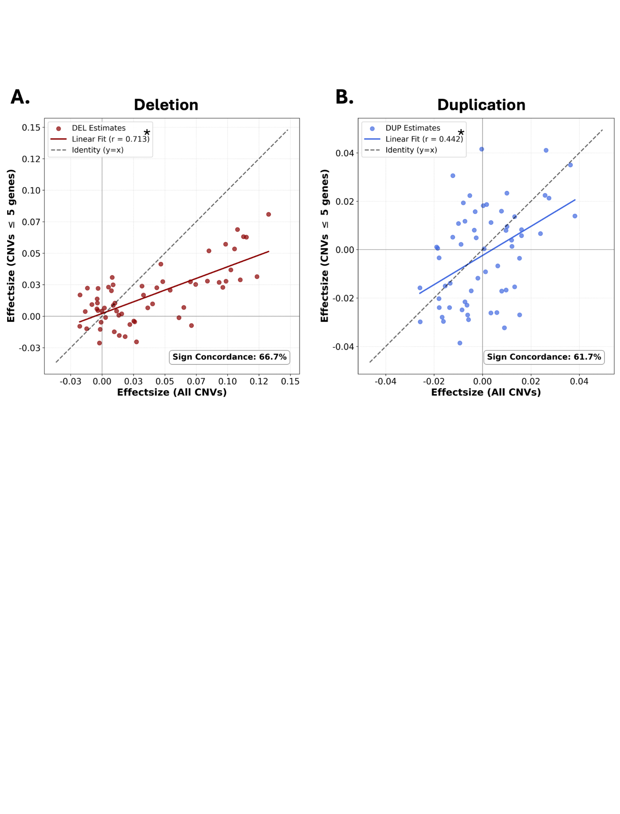
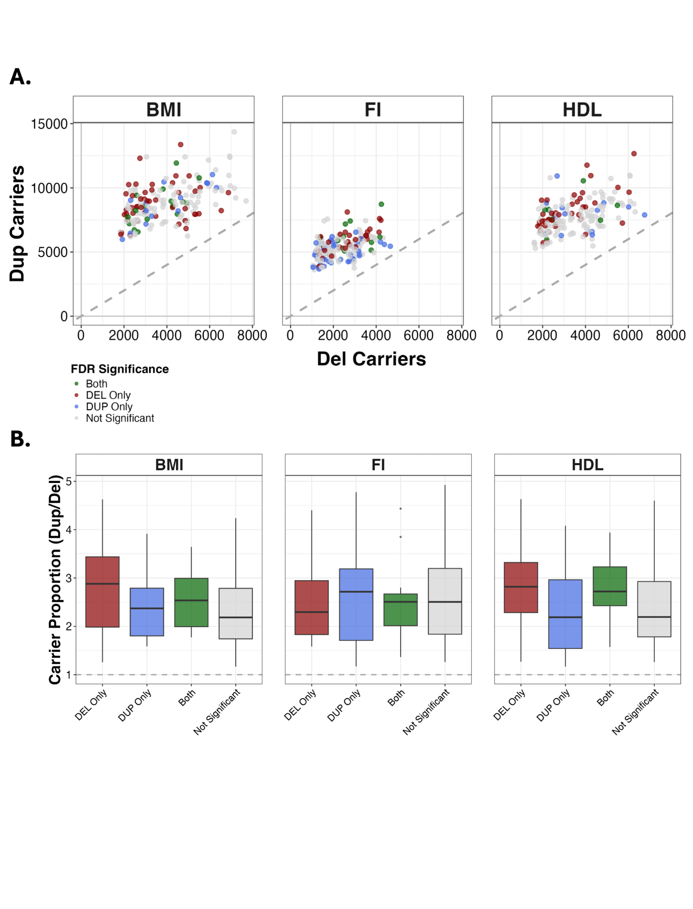
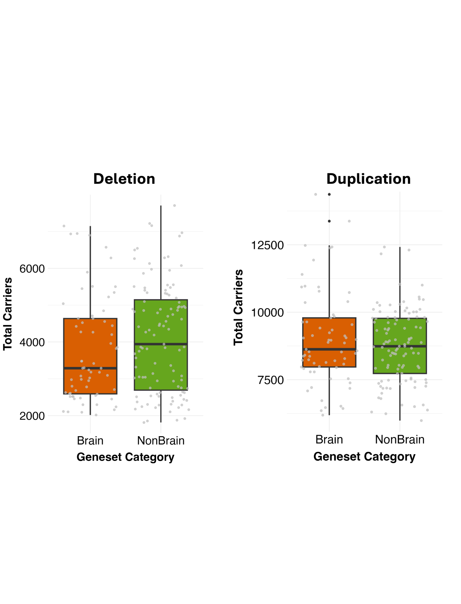
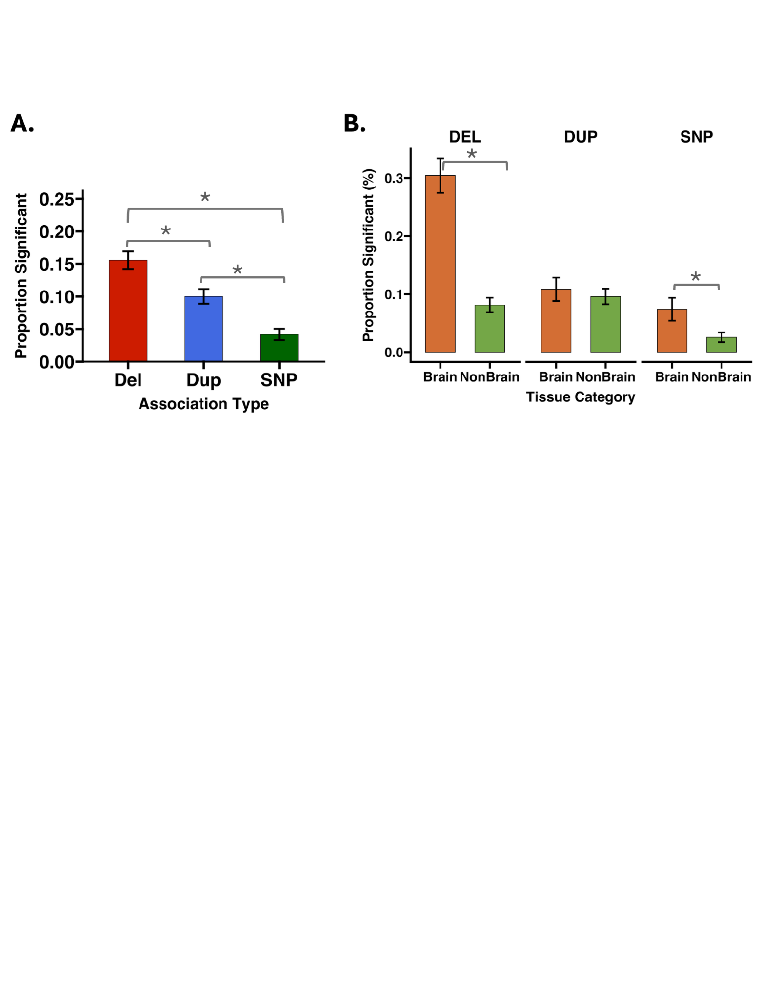

# Why trust the framework?

FunBurd tests many rare CNVs across overlapping functional gene sets. We therefore evaluated whether the main conclusions could be explained by recurrent loci, large multigenic CNVs, unequal carrier counts, correlated traits, or overlapping gene sets.

## Are the findings driven by a few recurrent CNVs?

Most observed CNVs were ultra-rare. Only 0.42% of duplications and 1.21% of deletions were carried by at least 20 participants. Removing CNVs carried by more than 20 participants preserved association-effect profiles and functional-burden-pleiotropy rankings.



## Are the findings driven by large multigenic CNVs?

We repeated the analysis after excluding CNVs encompassing five or more genes. Effect-size profiles remained concordant with those from the primary model, indicating that the main patterns were not solely driven by a small number of large events.



## Are deletion-specific and duplication-specific findings explained by unequal power?

Duplications were generally more frequent than deletions. However, the relative deletion-to-duplication carrier count did not predict whether an association was deletion-specific, duplication-specific, significant for both CNV types, or non-significant.



## Do brain-related sets simply contain more CNV carriers?

Carrier counts did not differ significantly between brain and non-brain gene sets in the representative BMI analysis. Higher functional burden pleiotropy in brain-related gene sets was therefore not explained by a simple difference in CNV frequency.



## How were trait correlation and gene-set overlap addressed?

We repeated key comparisons after retaining a filtered set of gene sets with pairwise Jaccard overlap no greater than 20% and a subset of 15 traits with low phenotypic correlation. The main conclusions were preserved.



## Additional sensitivity analyses

We also examined robustness across:

- alternative RNA-sequencing resources;
- ancestry strata;
- age strata;
- sex strata;
- phenotype-measurement routes;
- less-correlated trait subsets.

See the [sensitivity-analysis index](../advanced_methods/sensitivity_index.md).

```{admonition} Validation does not eliminate every limitation
:class: note
Sensitivity analyses test specific alternative explanations. They do not prove that residual confounding, cohort-specific ascertainment, CNV-calling artifacts, or gene-set heterogeneity are impossible. See [Assumptions and limitations](../reference/assumptions_limitations.md).
```

## Next

Continue to [Replication and comparison across variant classes](replication_variant_classes.md).
